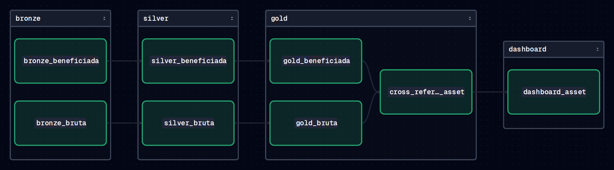

# Bateia Ops

Reprodutibilidade (Docker) e orquestração (Dagster) para o pipeline de dados
do [Bateia](https://github.com/Caio-Analytics/bateia) — o mesmo ETL em
camadas sobre dados da mineração brasileira (ANM/RAL), agora rodando como um
grafo de assets com lineage, retries, checks de qualidade e schedule, em vez
de um script chamado na mão.



## Por que este repo existe

O [Bateia](https://github.com/Caio-Analytics/bateia) prova que o pipeline
funciona: ingestão de CSV governamental sujo, camadas Bronze/Silver/Gold,
cruzamento via SQL, testes, CI, dashboard. O que ele não prova é que esse
pipeline sobrevive fora do notebook de quem escreveu — que ele roda igual em
qualquer máquina, que uma etapa falhando não derruba o resto silenciosamente,
e que dá pra ver o lineage entre as camadas sem ler o código.

Este repo pega o mesmo ETL (código inalterado, importado de `etl/` e
`dashboard/`) e adiciona só isso:

- **Docker Compose** — `docker compose up` sobe tudo, sem instalar Python,
  Polars, DuckDB ou nada localmente.
- **Dagster** — cada estágio (Bronze, Silver, Gold, Cruzamento, Dashboard)
  vira um [software-defined asset](https://docs.dagster.io/concepts/assets/software-defined-assets),
  com retry automático, metadata (linhas processadas, preview, tamanho do
  artefato final) e um **asset check** que barra o pipeline se o cruzamento
  Bruta × Beneficiada degenerar para zero substâncias comparáveis.

## Quickstart

```bash
docker compose up --build
```

Depois abra [`localhost:3000`](http://localhost:3000), vá em **Lineage** e
clique em **Materialize all**. O grafo materializa na ordem correta
(Bronze → Silver → Gold → Cruzamento → Dashboard) e o dashboard final sai em
`output/dashboard.html`, no volume montado — não precisa entrar no
container pra pegar o arquivo.

## O grafo de assets

```
bronze_bruta ──┐
               ├──▶ silver_bruta ──┐
bronze_beneficiada ┘               ├──▶ silver_beneficiada ──┐
                                                               │
        gold_bruta ◀── silver_bruta                           │
        gold_beneficiada ◀── silver_beneficiada                │
                    │                                          │
                    └──▶ cross_reference_asset ──▶ dashboard_asset
                              │
                              └──▶ [check] cross_reference_has_comparable_substances
```

(veja o grafo real, já materializado, no screenshot acima — a ordem lógica é
a mesma: as duas fontes sobem em paralelo por Bronze → Silver → Gold, se
encontram no cruzamento SQL via DuckDB, e terminam no dashboard.)

Cada asset em `orchestration/assets.py` é uma chamada fina para a função de
transformação já existente em `etl/` — o valor do Dagster aqui é orquestração
(dependências, retry, observabilidade), não reescrever a lógica em memória.

## O que muda em relação ao Bateia

| | Bateia | Bateia Ops |
|---|---|---|
| Execução | `python -m etl.pipeline` | `dagster dev` ou `dagster asset materialize` |
| Falha parcial | pipeline inteiro para | asset falho é isolado, retry automático (2x) |
| Observabilidade | logs no console | UI com lineage, metadata por asset, histórico de runs |
| Qualidade de dado | validado só em testes | `asset_check` roda a cada materialização |
| Ambiente | requer Python + libs instaladas | `docker compose up` |
| Agendamento | nenhum | `ScheduleDefinition` diário (desativado por padrão) |

## Rodando sem Docker

```bash
python -m venv .venv && source .venv/bin/activate
pip install -r requirements.txt

# testes herdados do Bateia (29 casos, cobrindo bronze/silver/gold/cruzamento)
python -m pytest tests/ -v

# materializar tudo via CLI, sem subir a UI
dagster asset materialize -m orchestration.definitions --select "*"

# ou com a UI (lineage, runs, schedules)
dagster dev -m orchestration.definitions
```

## Stack

Python · Polars · pandas · DuckDB · PyArrow/Parquet · **Dagster** ·
**Docker / Docker Compose** · pytest · GitHub Actions (CI roda os testes, um
smoke test materializando o grafo inteiro, e o build da imagem Docker).

## Dados

Mesma fonte do Bateia: Relatório Anual de Lavra (RAL), publicado pela ANM
(Agência Nacional de Mineração) — dados públicos, ~10.300 registros,
2010–2025. Detalhes sobre as duas bases (Produção Bruta e Produção
Beneficiada) e as inconsistências que o pipeline trata estão documentados no
[README do Bateia](https://github.com/Caio-Analytics/bateia#as-bases).
