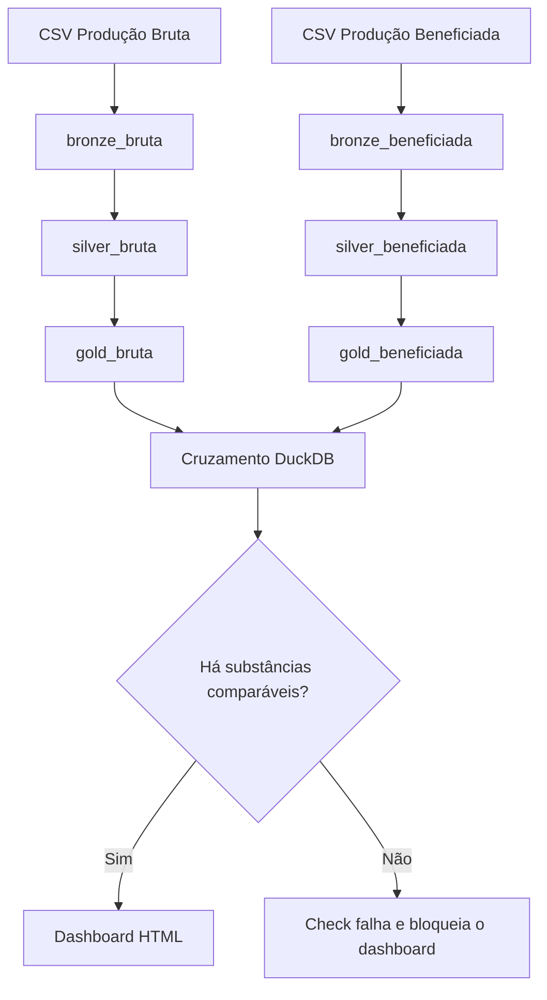

# Estrato Data Platform

Pipeline de dados da mineração brasileira com Dagster, Docker e validação de qualidade antes da geração do dashboard.

[](https://github.com/Caio-Analytics/Estrato-Data-Platform/actions/workflows/ci.yml)
[](requirements.txt)
[](LICENSE)

[Execução local](#execute-localmente) · [Arquitetura](#arquitetura) · [Decisões técnicas](#decisões-técnicas) · [Testes](#validação)

Desenvolvi este projeto para demonstrar como organizo a execução de um pipeline analítico: dependências explícitas, acompanhamento por etapa e critérios de qualidade para entregar o resultado. Os dados são de Produção Bruta e Produção Beneficiada do Relatório Anual de Lavra (ANM/RAL).

O ETL deriva do projeto hoje chamado [Estrato Panorama Mineral Brasileiro](https://github.com/Caio-Analytics/Estrato-Panorama-Mineral-Brasileiro), anteriormente Bateia. Esta versão concentra o trabalho de orquestração em Dagster e execução em Docker, sobre as transformações Python presentes neste repositório.

## Veja a execução


O Dagster mostra as dependências e o histórico das execuções. Bronze e Silver registram quantidade de linhas, colunas e uma amostra; Gold registra os artefatos gerados. O último asset entrega um dashboard HTML que abre direto no navegador.

## O que você pode avaliar aqui

| Competência | Implementação | Onde conferir |
|---|---|---|
| Engenharia de dados | CSV → Parquet → agregações, com separação Bronze/Silver/Gold | [`etl/`](etl/) |
| Orquestração | Oito assets, dependências explícitas e até duas retentativas por asset | [`orchestration/assets.py`](orchestration/assets.py) |
| Qualidade em execução | Check bloqueia o dashboard se o cruzamento não encontrar substâncias comparáveis | [`tests/test_orchestration.py`](tests/test_orchestration.py) |
| SQL analítico | Cruzamento das bases com DuckDB e critérios mínimos de comparação | [`etl/cross_reference.py`](etl/cross_reference.py) |
| Ambiente e integração contínua | Docker Compose, testes, materialização completa e build da imagem no CI | [Workflow](.github/workflows/ci.yml) |
| Entrega para análise | Dashboard em um único HTML com dados incorporados | [`dashboard/`](dashboard/) |

## Execute localmente

Com Docker e Docker Compose instalados, clone o projeto e inicie o serviço:

```bash
git clone https://github.com/Caio-Analytics/Estrato-Data-Platform.git
cd Estrato-Data-Platform
docker compose up --build
```

1. Abra [localhost:3000](http://localhost:3000).
2. No grafo de assets, clique em **Materialize all**.
3. Após a execução concluir, abra `output/dashboard.html` no navegador.

Os CSVs usados na demonstração já estão em [`data/raw/`](data/raw/). As camadas geradas ficam em `data/` e o dashboard em `output/`, ambos montados no host. O histórico do Dagster fica em um volume Docker nomeado e é preservado ao recriar o container. `docker compose down -v` remove esse histórico.

<details>
<summary>Executar com Python, sem Docker</summary>

Use Python 3.12, a mesma versão do CI e da imagem Docker.

```bash
python -m venv .venv
source .venv/bin/activate
pip install -r requirements.txt

# Materializar o grafo sem abrir a interface
dagster asset materialize -m orchestration.definitions --select "*"

# Abrir a interface
dagster dev -m orchestration.definitions
```

No PowerShell, ative o ambiente com `.venv\Scripts\Activate.ps1`.

</details>

## Arquitetura



As duas fontes têm cadeias independentes até o cruzamento. O diagrama representa dependências; a concorrência efetiva depende do executor. Cada asset chama a transformação correspondente de `etl/` ou `dashboard/`, mantendo as regras de dados separadas da orquestração.

## Decisões técnicas

- **Qualidade antes da entrega.** O check usa a contagem de substâncias comparáveis produzida pelo cruzamento. Zero comparáveis causa falha e impede a execução do dashboard naquele run. Os testes simulam tanto a falha quanto a liberação da etapa final.
- **Cuidado com as unidades.** Produção Beneficiada contém quantidades em unidades diferentes. As agregações gerais usam valores monetários para evitar somas de quantidades incompatíveis. Essa regra está explícita em [`DatasetSpec`](etl/config.py) e nas transformações.
- **Retentativas limitadas.** Cada asset tem até duas retentativas, com intervalo de cinco segundos. Isso permite repetir uma etapa após uma falha transitória; dependentes de uma etapa que continua falhando não avançam.
- **Histórico persistente.** Um volume mantém os eventos e as execuções do Dagster entre recriações do container, permitindo investigar o que ocorreu em cada run.

Há um agendamento diário configurado para `06:00 UTC`, desativado por padrão. Ele demonstra a configuração de schedules; os arquivos de entrada são um recorte estático e não há coleta automática de novas publicações da ANM.

## Validação

```bash
python -m pytest tests/ -v
```

A suíte cobre conversão de decimais brasileiros, schema, preservação de registros, UFs, agregações e regras do cruzamento. Os testes de orquestração usam dados sintéticos e o motor de execução do Dagster para verificar que um check reprovado impede a etapa seguinte.

A cada push na `main` ou pull request, o [GitHub Actions](https://github.com/Caio-Analytics/Estrato-Data-Platform/actions/workflows/ci.yml) executa a suíte, materializa o grafo completo e faz o build Docker. O HTML gerado fica disponível como artefato `dashboard` na execução do CI.

## Escopo e limites

Este é um projeto de portfólio executável localmente. As dependências têm versões mínimas, sem lockfile; Docker padroniza a configuração do ambiente, mas os builds podem resolver versões diferentes ao longo do tempo. Os arquivos das camadas usam caminhos fixos, portanto o projeto pressupõe uma execução por vez. O check bloqueia uma nova geração do dashboard, mas não apaga um HTML de execução anterior.

O cruzamento compara valores agregados entre bases. A diferença chamada `valor_agregado` no código não representa lucro ou margem de uma operação. A fonte, as unidades e o recorte precisam ser considerados na interpretação dos resultados.

Python · Polars · pandas · DuckDB · Parquet · Dagster · Docker Compose · pytest · GitHub Actions

Projeto de [Caio Leão](https://github.com/Caio-Analytics). Licença [MIT](LICENSE).
